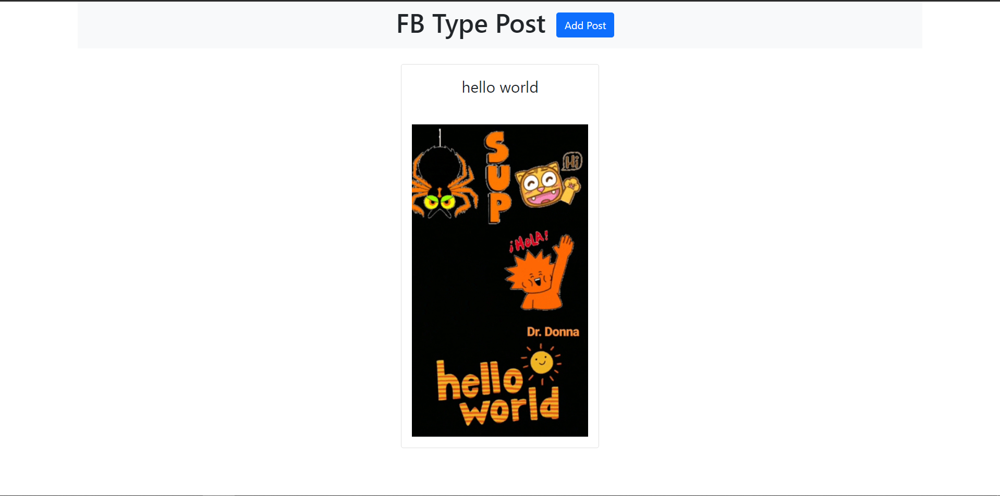
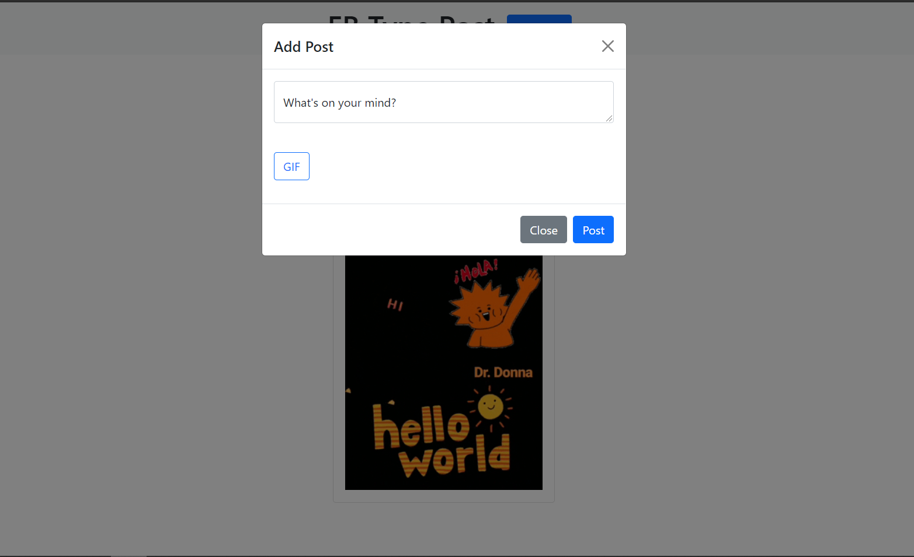
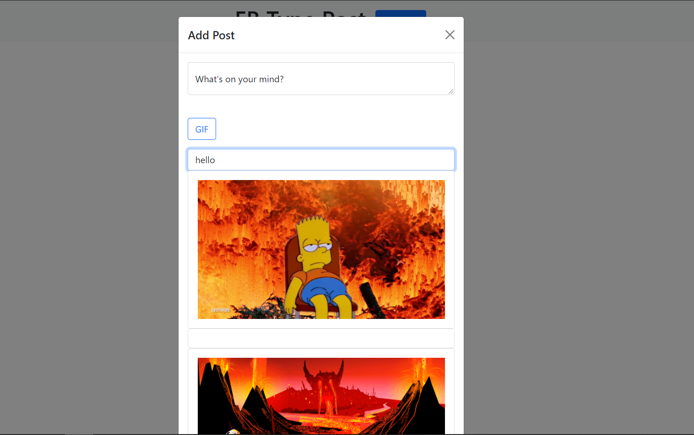

# Basic GIPHY App

This is a learning repo. This repo is developed using React and GIPHY Api

## Tech used

- React
- GIPHY Api (for giphs)
- Bootstrap (For styling)
- Axios (For http calling)

## Screens

Home


Post


Gif


## To Run Dev Server

- Clone the repo into local system
- Install the necessary dependencies using below command

```js
npm install
```

- run the dev server using below command

```js
npm start
```

# Note:

- After cloning and installing all the dependencies in the project create a `dotEnv(.env)` file and add the API key (obtained from [GIPHY API]()) of yours with the name `REACT_APP_GIPHY_KEY` because I used the same name in the component(`/components/Navbar.js`). You can change the name as you like but don't forget to add `REACT_APP<name>` before the name.

- In this project, to store the post data I used `localstorage`. If you want to make this as a primary project I recommend using DB to store the post data.
- There is no authnetication for this project,if interested you can implement.
